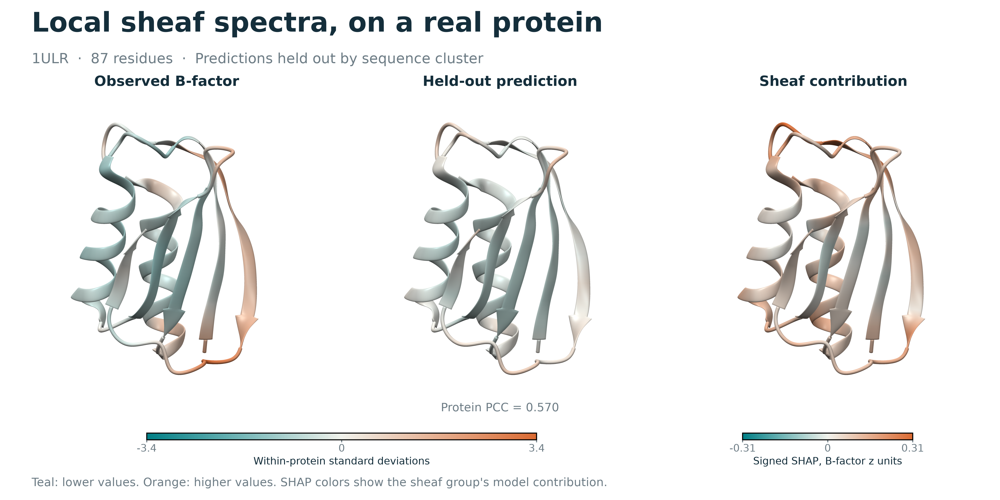

# Interpreting Local Sheaf Spectra for Protein B-Factor Prediction

Research code, mathematical constructions, and figures for a manuscript by **Ryan Charette, Independent researcher**.

**What information do local sheaf spectra capture, and does it improve protein B-factor prediction beyond simpler geometry?**



1ULR was chosen before inspecting predictive performance. The three aligned views show measured relative B-factor, the prediction from the actual sequence-cluster-held-out model, and the signed contribution of its sheaf features. Color is model attribution in the third view; it does not identify a causal mechanism or molecular motion.

## Paper and findings

[Manuscript (PDF)](paper/manuscript.pdf) · [Supplement (PDF)](paper/supplement.pdf) · [LaTeX source](paper/manuscript.tex) · [Figures](paper/figures)

The mathematical analysis separates a legacy weighted graph descriptor from a compatible cellular sheaf on genuine alpha complexes. Several legacy statistics reduce exactly to neighborhood size and graph density. The center-zero sheaf splits into a deletion block and an augmented weighted link block; in degree zero, its center term is an inverse-square packing scalar. On fixed vertices, degree-zero persistence duplicates the ordinary upper-radius operator, so the persistence experiment uses degree one.

The fresh benchmark uses **364 structures, 78,400 residues, and 349 observed-sequence components**. Every model below uses the same five folds and fixed 200-tree Random Forest. The endpoint is the within-protein standardized crystallographic C-alpha B-factor.

| Features | Mean protein Pearson correlation | 95% cluster-bootstrap interval |
|---|---:|---:|
| Graph geometry | 0.625 | [0.611, 0.639] |
| Legacy graph spectra | 0.611 | [0.597, 0.625] |
| Graph + legacy spectra | 0.628 | [0.614, 0.642] |
| Center-zero sheaf spectra | 0.565 | [0.550, 0.580] |
| Graph + identity sheaf | 0.629 | [0.615, 0.643] |
| Graph + geometric sheaf | 0.631 | [0.617, 0.644] |
| Graph + center-zero sheaf | 0.627 | [0.613, 0.641] |

Adding center-zero degree-zero spectra to the graph baseline changes mean protein correlation by **+0.0018**, with paired 95% interval **[-0.0009, +0.0044]**. This primary comparison does not resolve an improvement in mean correlation. The paper also reports Spearman correlation, normalized RMSE, protein-only split sensitivity, ordinary/persistent degree-one comparisons, and scale/spectrum ablations. Full per-protein results and provenance are in [results/study](results/study); earlier numbers are separated in [results/historical](results/historical).

Degree-one persistence changes the spectral descriptors, but all six paired
comparisons with its lower and upper static controls have intervals containing
zero. These results concern the tested scales, summaries, and fixed learner;
they do not establish equivalence or imply that persistence contains no information.

## Reproduce the study

Use Python 3.12 and run scripts from the repository root. The exact executed package versions are in [environment.txt](results/study/environment.txt).

```sh
python -m pip install -r results/study/environment.txt
python scripts/fetch_data.py
python scripts/prepare_dataset.py
python scripts/generate_study_features.py --degree1 --workers 4 --timing-name d1_timing.csv
python scripts/augment_upper_features.py --workers 4
python scripts/run_evaluations.py --jobs 4
python scripts/explain_cases.py
python scripts/explain_cases.py --verify-only
python scripts/characterize_features.py
python scripts/summarize_study.py
python scripts/make_figures.py --all
python scripts/audit_study.py --require-complete --require-cases --out results/study/final_audit.json
```

[Reproduction notes](docs/reproduction.md) explain the inputs, compute accounting, exact environment, outputs, and PDF build. Numerical checks run with `python -m pytest -q`; `python scripts/validate_operators.py` writes the independent operator audit. A small synthetic legacy-graph demonstration is available through `python scripts/run_toy_demo.py`.

The [final audit](results/study/final_audit.json) verifies all 14 feature blocks,
160 forest fits, 2,508,800 held-out residue predictions, and both explanation cases.
The 53 scientific tests pass. Timing measurements and their scope are recorded in
[compute provenance](results/study/compute_provenance.json).

Raw structures, feature matrices, complete prediction files, and fitted forests are regenerated outside Git. Compact metrics, full case-study SHAP tables, background identifiers, residue mappings, figure inputs, and source hashes are retained. Finalize all feature caches before fitting so their recorded hashes remain stable.

## Scope and provenance

This is one structural collection, one fixed split realization, and one fixed learner. B-factors include static disorder and crystallographic effects; this study does not validate solution dynamics. The sequence rule was amended before fitting because the original shorter-chain criterion connected the entire collection through tiny auxiliary chains. The final rule uses reciprocal coverage and a minimum aligned length, with exact whole-record duplicate control; short and fragmentary homologs can still escape grouping. Confidence intervals are conditional on the fitted models and folds.

The benchmark is acquired from the pinned [MDG_bfactor source](https://github.com/fenghon1/MDG_bfactor/tree/c987feb2c45c785799685c03d270ea8053e5706d). Full case structures come from the PDB. [Research provenance](docs/research_provenance.md) inventories the earlier manuscripts, implementations, and result snapshots. The current article uses newly generated results, and distinguishes mathematical identities from model attributions and biological interpretation.

## Citation

```bibtex
@unpublished{charette2026localsheaf,
  author = {Ryan Charette},
  title = {Interpreting Local Sheaf Spectra for Protein B-Factor Prediction},
  year = {2026},
  note = {Research manuscript},
  url = {https://github.com/ryan-charette/psl-protein-flexibility/tree/research-pivot}
}
```

Code is distributed under the [MIT license](LICENSE). Third-party data and prior methods retain their source attribution in [NOTICE.md](NOTICE.md) and the manuscript bibliography.
